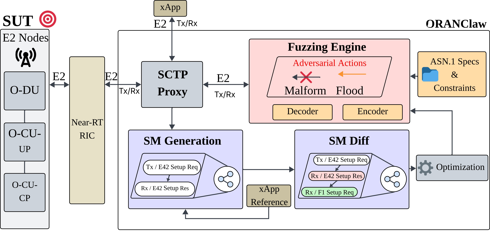

<a href="https://asset-group.github.io/ORANClaw-E2-MitM-Fuzzing/">
  
</a>

# ORANClaw: Shredding E2 Nodes via Structure-aware MiTM Fuzzing


<p align="center">
    
    
    
</p>

**ORANClaw** operates as a Man-in-the-Middle (MitM) proxy on the **E2 interface**, intercepting and mutating E2AP messages between Near-RT RIC and E2 Nodes.

In our experiments across **5 O-RAN implementations**, O-RANClaw discovered **71 new vulnerabilities**:
- 1 in O-RAN SC RIC
- 5 in VIAVI TeraVM RSG
- 19 in OpenAirInterface (OAI)
- 18 in ns-3
- 28 in FlexRIC

---

<small>

#### Core Features

🔍 **Intercept**: Man-in-the-Middle proxy (SCTP) on E2 interface between NearRT-RIC and E2 Nodes (gNB/O-CU/O-DU).

⚡  **ASN.1-Aware Mutation**: Respects structural and semantic constraints of E2AP messages.

🧬 **Genetic Algorithm Optimization**: Optimizes state transition exploration and mutation strategies.

🎯 **Dual-Target Evaluation**: Comprehensive testing of both NearRT-RIC and gNB implementations.

#### Example Use Cases

💥 **Crash Base Stations**: Trigger DoS vulnerabilities in O-RAN components.

🔐 **Service Model Attacks**: Target any O-RAN Service Models (SMs).

🔍 **Security Assessment**: Systematic evaluation of O-RAN implementation security.

ORANClaw artifacts paper received badges **Available**, **Functional** and **Reproduced** in the 19th ACM WiSec '26. Artifacts PDF available [here](docs/ORANClawArtifacs.pdf)

</small>

---

## 🌐 Overview

The following diagram illustrates O-RANClaw's architecture and operational flow within the O-RAN ecosystem:



---

## 📑 Table of Contents

- [ORANClaw: Shredding E2 Nodes via Structure-aware MiTM Fuzzing](#oranclaw-shredding-e2-nodes-via-structure-aware-mitm-fuzzing)
      - [Core Features](#core-features)
      - [Example Use Cases](#example-use-cases)
  - [🌐 Overview](#-overview)
  - [📑 Table of Contents](#-table-of-contents)
  - [🚀 Quick Start via Docker](#-quick-start-via-docker)
    - [📋 Requirements](#-requirements)
    - [⚙️ Installation](#️-installation)
    - [🔧 Running O-RANClaw with OpenAirInterface](#-running-o-ranclaw-with-openairinterface)
    - [🔧 Running O-RANClaw with ns-3](#-running-o-ranclaw-with-ns-3)
  - [Discovered Vulnerabilities](#discovered-vulnerabilities)
    - [Summary by Implementation](#summary-by-implementation)
    - [Complete Vulnerability Table](#complete-vulnerability-table)
  - [📁 Repository Structure](#-repository-structure)
    - [🔩 Key Components](#-key-components)
  - [🔬 Research Questions (RQs)](#-research-questions-rqs)
  - [📚 Citation](#-citation)
  - [⚠️ Disclaimer](#️-disclaimer)

---

## 🚀 Quick Start via Docker

### 📋 Requirements

**Hardware:**
- **CPU:** Minimum 4 cores (8+ cores recommended for concurrent fuzzing).
- **RAM:** Minimum 16GB (32GB recommended for stable OAI gNB + UE simulation).
- **Storage:** At least 20GB free. Up to 500GB if uncompressing logs for RQs.

**Software:**
- **OS:** Ubuntu 24.04 (Main runtime environment)
- **Docker:** Latest version for container orchestration.
- **Python >= 3.12:** Required for the MitM Fuzzing Engine.
- **TShark >= 4.2.2:** For capturing E2AP/SCTP traffic.
- **asn1c compiler >= 7.8:** For encoding/decoding ASN.1.

### ⚙️ Installation

**1. Clone O-RANClaw repository:**

```bash
cd $HOME
git clone https://github.com/asset-group/ORANClaw-E2-MitM-Fuzzing.git
cd $HOME/ORANClaw-E2-MitM-Fuzzing
```

**2. Install System Requirements:**

```bash
chmod +x requirements.sh
./requirements.sh
source $HOME/.venvs/oran-env/bin/activate
```

**3. Install wdissector & asn1c:**

```bash
cd $HOME/ORANClaw-E2-MitM-Fuzzing
wget -O vakt-ble-defender.zip https://zenodo.org/records/18368683/files/vakt-ble-defender.zip?download=1
unzip vakt-ble-defender.zip
rm -rf vakt-ble-defender.zip

cd $HOME/ORANClaw-E2-MitM-Fuzzing/asn1
wget https://zenodo.org/records/18368683/files/asn1c.zip?download=1 -O asn1c.zip
unzip asn1c.zip
rm -rf asn1c.zip
chmod +x ./reader
chmod +x ./reader_json
```

### 🔧 Running O-RANClaw with OpenAirInterface

**1. Start Core Network (Terminal 1):**

```bash
cd $HOME/ORANClaw-E2-MitM-Fuzzing
docker compose --profile core up
```

**2. Add UE Subscribers:**

```bash
cd $HOME/ORANClaw-E2-MitM-Fuzzing/scripts/
./add_subcribers.sh
```

**3. Start the O-RAN gNB, UE simulation, and Near-Real-Time RIC (Terminal 2):**

```bash
cd $HOME/ORANClaw-E2-MitM-Fuzzing/
docker compose --profile gnb-rfsim up
```

**4. Start O-RANClaw Fuzzer (Terminal 3):**

```bash
cd $HOME/ORANClaw-E2-MitM-Fuzzing/asn1
python3 client_server.py
```

**5. Start xApp (Terminal 4):**

```bash
cd $HOME/ORANClaw-E2-MitM-Fuzzing/
docker compose --profile xapp up
```

### 🔧 Running O-RANClaw with ns-3

**1. Install ns-3 O-RAN Simulator:**

```bash
cd $HOME
git clone https://github.com/Orange-OpenSource/ns-O-RAN-flexric.git
cd ns-O-RAN-flexric
git checkout 7936f62f
```

**2. Configure and run:**

Modify `IP_MITM` in `client_server_ns3.py` to your host IP, then:

```bash
cd $HOME/ORANClaw-E2-MitM-Fuzzing/asn1
./ns3_fuzzing.sh
```

---

## Discovered Vulnerabilities

### Summary by Implementation

| Implementation | Bugs Found | Status |
|----------------|------------|--------|
| O-RAN SC RIC | 1 | 1 CVE assigned |
| VIAVI TeraVM RSG | 5 | Pending disclosure |
| OpenAirInterface (OAI) | 19 | 7 CVEs assigned |
| ns-3 | 18 | Pending disclosure |
| FlexRIC | 28 | 1 existing CVE, 27 pending |
| **Total** | **71** | **8 CVEs + 63 pending** |

Causes in **bold** indicate structural message mutations rather than single-field modifications. "Unable To Recover" denotes failures to restore normal operation from crashes in previous sessions.

### Complete Vulnerability Table

| VulnID | Implementation | CVE | Vulnerability | General Cause | Component | Threat | Location |
|--------|----------------|-----|---------------|---------------|-----------|--------|----------|
| VulnOSCRIC-01 | O-RAN SC RIC | CVE-2025-67398 | Unhandled Exception | Flooding E2SetupRequest | E2 Termination | DoS | Not Specified |
| VulnVIAVI-01 | VIAVI TeraVM RSG | Pending | Heap/Stack Buffer Overflow | **Malformed RC SM Structure** | gNB | Mem. Corrupt | Not Specified |
| VulnVIAVI-02 | VIAVI TeraVM RSG | Pending | Assertion | Malformed KPM SM Field | RIC | DoS | nr-gnb-mac.cc:1136 |
| VulnVIAVI-03 | VIAVI TeraVM RSG | Pending | Unhandled Exception | Malformed RICSubscriptionRequest Field | gNB | DoS | Not Specified |
| VulnVIAVI-04 | VIAVI TeraVM RSG | Pending | Buffer Over-read | Malformed KPM SM Field | RIC | Mem. Corrupt | Not Specified |
| VulnVIAVI-05 | VIAVI TeraVM RSG | Pending | Unhandled Exception | **Malformed KPM SM Structure** | GUI, gNB, RIC | DoS | Not Specified |
| VulnOAI-01 | OAI | CVE-2024-48408 | Assertion | Malformed MAC SM Field | O-DU | DoS | ran_func_mac.c:126 |
| VulnOAI-02 | OAI | CVE-2025-52142 | Assertion | Malformed KPM SM Field | O-DU/CU-UP | DoS | ran_func_kpm_subs.c:226 |
| VulnOAI-03 | OAI | CVE-2025-52146 | Assertion | Malformed KPM SM Field | O-DU/CU-UP | DoS | msg_handler_agent.c:136 |
| VulnOAI-04 | OAI | CVE-2025-52150 | Assertion | **Truncated MAC SM Structure** | O-DU | DoS | mac_dec_plain.c:190 |
| VulnOAI-05 | OAI | Pending | Assertion | Malformed KPM SM Field | O-DU | DoS | ran_func_kpm.c:267/268 |
| VulnOAI-06 | OAI | Pending | Assertion | **Malformed KPM SM Structure** | O-DU | DoS | ran_func_kpm.c:72 |
| VulnOAI-07 | OAI | CVE-2025-52148 | Assertion | Unexpected TC SM Field | O-CU-UP | DoS | tc_dec_plain.c:1418 |
| VulnOAI-08 | OAI | CVE-2025-52151 | Assertion | Malformed KPM SM Field | O-CU-UP | DoS | ran_func_kpm.c:230 |
| VulnOAI-09 | OAI | CVE-2025-52147 | Assertion | Zero-ed RC SM Field | O-CU-CP | DoS | rc_dec_asn.c:953 |
| VulnOAI-10 | OAI | Pending | Assertion | Unable To Recover | O-CU-CP (E1) | DoS | cucp_cuup_e1ap.c:31 |
| VulnOAI-11 | OAI | Pending | Assertion | **Malformed KPM SM Structure** | O-CU-UP | DoS | ran_func_kpm.c:177 |
| VulnOAI-12 | OAI | Pending | Assertion | Malformed E42RICsubscriptionDeleteRequest Field | O-CU-CP | DoS | bimap.c:126 |
| VulnOAI-13 | OAI | Pending | Assertion | Malformed KPM SM Field | O-CU-UP | DoS | ran_func_kpm.c:168 |
| VulnOAI-14 | OAI | Pending | Assertion | Multiple Malformed KPM Fields | O-DU/CU-UP | DoS | ran_func_kpm.c:71 |
| VulnOAI-15 | OAI | Pending | Assertion | Invalid KPM SM Field | O-CU-CP/CU-UP | DoS | ran_func_kpm.c:229 |
| VulnOAI-16 | OAI | Pending | Assertion | Malformed KPM SM Field | O-CU-CP/UP | DoS | ran_func_kpm.c:176 |
| VulnOAI-17 | OAI | Pending | Assertion | Malformed KPM SM Field | O-CU-CP/UP | DoS | ran_func_kpm.c:167 |
| VulnOAI-18 | OAI | Pending | Assertion | Unable To Recover | O-CU-UP/CP | DoS | e2_agent.c:242 |
| VulnOAI-19 | OAI | Pending | Assertion | Unable To Recover | O-CU-UP/CP | DoS | plugin_agent.c:286 |
| VulnNS-01 | NS-3 | Pending | Buffer Overflow | Malformed RICSubscriptionRequest Field | gNB | Mem. Corrupt | Not Specified |
| VulnNS-02 | NS-3 | Pending | Heap-based Buffer Overflow | Malformed E42SetupRequest Field | gNB | Mem. Corrupt | Not Specified |
| VulnNS-03 | NS-3 | Pending | Heap-Based Buffer Overflow | E42SetupRequest Duplication | gNB | Mem. Corrupt | Not Specified |
| VulnNS-04 | NS-3 | Pending | Assertion | Malformed E42RICsubscriptionDeleteRequest | gNB | DoS | ipv4-l3-protocol.cc:972 |
| VulnNS-05 | NS-3 | Pending | Assertion | Malformed RICSubscriptionRequest Field | gNB | DoS | ipv4-l3-protocol.cc:580 |
| VulnNS-06 | NS-3 | Pending | Assertion | Malformed RICSubscriptionRequest Field | LTE eNB | DoS | lte-spectrum-phy.cc:486 |
| VulnNS-07 | NS-3 | Pending | Null pointer dereference | Malformed RICSubscriptionRequest Field | gNB | Mem. Corrupt | ptr.h:638 |
| VulnNS-08 | NS-3 | Pending | Out-of-bounds read | Malformed RICSubscriptionRequest Field | gNB | Info. Disclosure | net-device-queue-interface.cc:216 |
| VulnNS-09 | NS-3 | Pending | Null pointer dereference | Malformed RICSubscriptionRequest Field | gNB | Mem. Corrupt | ptr.h:630 |
| VulnNS-10 | NS-3 | Pending | Assertion | Malformed RICSubscriptionRequest Field | gNB | DoS | object.cc:349 |
| VulnNS-11 | NS-3 | Pending | Assertion | Malformed RICSubscriptionRequest Field | gNB | DoS | traffic-control-layer.cc:337 |
| VulnNS-12 | NS-3 | Pending | Improper Input Validation | Malformed E42RICSubscriptionDeleteRequest Field | gNB | DoS | point-to-point-net-device.cc:279 |
| VulnNS-13 | NS-3 | Pending | Improper Check for Unusual/Exceptional Conditions | Malformed E42RICSubscriptionDeleteRequest Field | gNB | Improper File Handling | mmwave-phy-trace.cc:399 |
| VulnNS-14 | NS-3 | Pending | Assertion | Invalid KPM RC Field | gNB | DoS | default-simulator-impl.cc:235 |
| VulnNS-15 | NS-3 | Pending | Assertion | Malformed RICcontrolRequest Field | gNB | DoS | buffer.cc:183 |
| VulnNS-16 | NS-3 | Pending | Improper Input Validation | Malformed E42RICSubscriptionDeleteRequest Field | gNB | DoS | mmwave-phy-trace.cc:220 |
| VulnNS-17 | NS-3 | Pending | Improper Check for Unusual/Exceptional Conditions | Malformed E42RICSubscriptionDeleteRequest Field | gNB | Improper File Handling | mmwave-phy-trace.cc:71 |
| VulnNS-18 | NS-3 | Pending | Assertion | Malformed RICSubscriptionRequest Field | LTE eNB | DoS | mmwave-enb-phy.cc:1141 |
| — | FlexRIC | CVE-2024-34034 | Assertion | Flooding E42SubscriptionRequest | RIC | DoS | Not Specified |
| VulnFlex-01 | FlexRIC | Pending | Assertion | Malformed RICSubscriptionRequest Field | RIC | DoS | msg_handler_iapp.c:343 |
| VulnFlex-02 | FlexRIC | Pending | Assertion | Malformed E42RICsubscriptionDelete Fields | RIC E2AP(v2.03) | DoS | e2ap_msg_dec_asn.c:2534 |
| VulnFlex-03 | FlexRIC | Pending | Assertion | Malformed E42SubscriptionRequest Fields | RIC | DoS | msg_handler_ric.c:117 |
| VulnFlex-04 | FlexRIC | Pending | Assertion | Malformed E42SubscriptionRequest Fields | RIC E2AP(v2.03) | DoS | e2ap_msg_dec_asn.c:544 |
| VulnFlex-05 | FlexRIC | Pending | Assertion | Malformed E42SubscriptionRequest Field | RIC E2AP(v2.03) | DoS | e2ap_msg_dec_asn.c:487 |
| VulnFlex-06 | FlexRIC | Pending | Assertion | Malformed MAC SM Field | RIC E2AP(v2.03) | DoS | e2ap_msg_dec_asn.c:1107 |
| VulnFlex-07 | FlexRIC | Pending | Assertion | Malformed E42SubscriptionDelete Field | RIC E2AP(v2.03) | DoS | e2ap_msg_dec_asn.c:2523 |
| VulnFlex-08 | FlexRIC | Pending | Assertion | Malformed E42SubscriptionDelete Field | RIC E2AP(v2.03) | DoS | e2ap_msg_dec_asn.c:2540 |
| VulnFlex-09 | FlexRIC | Pending | Assertion | Flooding E42SetupRequest | RIC | DoS | e2ap_msg_enc_asn.c:3165 |
| VulnFlex-10 | FlexRIC | Pending | Assertion | Malformed E42SubscriptionRequest Field | RIC E2AP(v2.03) | DoS | e2ap_msg_dec_asn.c:536 |
| VulnFlex-11 | FlexRIC | Pending | Assertion | Malformed E42SubscriptionDeleteRequest Field | RIC E2AP(v2.03) | DoS | e2ap_msg_dec_asn.c:2531 |
| VulnFlex-12 | FlexRIC | Pending | Assertion | Malformed E42SubscriptionRequest Field | RIC E2AP(v2.03) | DoS | e2ap_msg_dec_asn.c:527 |
| VulnFlex-13 | FlexRIC | Pending | Assertion | E42SubscriptionDeleteRequest Field | RIC E2AP(v2.03) | DoS | e2ap_msg_dec_asn.c:2548 |
| VulnFlex-14 | FlexRIC | Pending | Assertion | Malformed E42SubscriptionRequest Field | RIC E2AP(v2.03) | DoS | e2ap_msg_dec_asn.c:477 |
| VulnFlex-15 | FlexRIC | Pending | Assertion | Unable to Recover | RIC | DoS | map_e2_node_sockaddr.c:154 |
| VulnFlex-16 | FlexRIC | Pending | Assertion | Malformed KPM SM Field | RIC | DoS | reg_e2_nodes.c:174 |
| VulnFlex-17 | FlexRIC | Pending | Assertion | Unable to Recover | RIC | DoS | map_ric_id.c:227 |
| VulnFlex-18 | FlexRIC | Pending | Assertion | Unable to Recover | RIC | DoS | assoc_rb_tree.c:457 |
| VulnFlex-19 | FlexRIC | Pending | Assertion | Flooding E42SubscriptionRequest | RIC | DoS | msg_handler_iapp.c:342 |
| VulnFlex-20 | FlexRIC | Pending | Assertion | Malformed E42SubscriptionRequest Field | RIC E2AP(v1.01) | DoS | e2ap_msg_dec_asn.c:418 |
| VulnFlex-21 | FlexRIC | Pending | Assertion | E42SubscriptionDeleteRequest Field | RIC E2AP(v1.01) | DoS | e2ap_msg_dec_asn.c:435 |
| VulnFlex-22 | FlexRIC | Pending | Assertion | Malformed E42SubscriptionRequest Field | RIC E2AP(v1.01) | DoS | e2ap_msg_dec_asn.c:378 |
| VulnFlex-23 | FlexRIC | Pending | Assertion | Malformed E42SubscriptionRequest Field | RIC E2AP(v1.01) | DoS | e2ap_msg_dec_asn.c:368 |
| VulnFlex-24 | FlexRIC | Pending | Assertion | Malformed E42SetupRequest Field | RIC E2AP(v1.01) | DoS | e2ap_msg_dec_asn.c:2113 |
| VulnFlex-25 | FlexRIC | Pending | Assertion | Unable To Recover | RIC E2AP(v1.01) | DoS | e2ap_msg_enc_asn.c:2731 |
| VulnFlex-26 | FlexRIC | Pending | Assertion | Malformed E42SubscriptionRequest Field | RIC E2AP(v1.01) | DoS | e2ap_msg_dec_asn.c:427 |
| VulnFlex-27 | FlexRIC | Pending | Assertion | Malformed E42SetupRequest Field | RIC E2AP(v1.01) | DoS | e2ap_msg_dec_asn.c:2101 |
| VulnFlex-28 | FlexRIC | Pending | Assertion | Unable To Recover | RIC | DoS | endpoint_ric.c:64 |

*Note: CVE links open the NVD entry. "Pending" entries are under coordinated disclosure. Bold causes = structural mutations.*

---

## 📁 Repository Structure

<details>
<summary>📂 Click to expand full project structure</summary>

```
.
├── 📄 core-open5gs.yaml          # Open5GS 5G core configuration
├── 📄 docker-compose.yaml        # Orchestration of O-RAN, RIC, and core components
├── 📄 Dockerfile                 # Container image for O-RANClaw experiments
├── 📄 gnb-oai.yaml               # OAI gNB configuration (CU/DU)
├── 📄 requirements.sh            # System-level dependency installation
├── 🐍 mitm.py                    # Core MitM proxy and fuzzing engine
├── 🐍 ORANClaw_demo.py           # Demo script for O-RANClaw capabilities
├── 🐍 docker_monitoring.py       # Automated testing and monitoring
├── 📁 configs/                   # Configuration files
│   ├── 📄 flexric.conf           # Near-RT RIC configuration
│   └── 📄 xapp.conf              # xApp configuration redirecting RIC IP to localhost
├── 📁 asn1/                      # ASN.1 specifications, code generation, and fuzzing logic
│   ├── 📁 asn1files/             # E2AP and E2SM ASN.1 specifications
│   ├── 📁 asn1c/                 # ASN.1 compiler and runtime support
│   ├── 📁 src/                   # Generated E2AP/E2SM encoders and decoders
│   ├── 🐍 client_server.py       # ASN.1-aware fuzzing engine (OAI version)
│   ├── 🐍 client_server_ns3.py   # ASN.1-aware fuzzing engine (ns-3 version)
│   ├── 📁 captures_bridge/       # Capture files during fuzzing sessions
│   ├── 📁 container_logs/        # OAI docker logs during fuzzing
│   ├── 📁 fuzzing_logs/          # Fuzzer logs during sessions
│   ├── 📁 state_machines/        # Learned E2 protocol state machines
│   └── 📁 state_machines_diff/   # Behavioral diffs between sessions
├── 📁 captures/                  # PCAP traces from baseline and attack experiments
├── 📁 libs/                      # Precompiled FlexRIC service models
├── 📁 scripts/                   # Experiment automation
│   ├── 📄 add_subscribers.sh     # Registers UEs in Open5GS (MongoDB)
│   └── 📄 run_ue_iperf.sh        # Traffic generation for evaluation
└── 📁 docs/                      # Design diagrams and system overview
```

</details>

### 🔩 Key Components

| Component | File/Directory | Description |
|-----------|----------------|-------------|
| **🎯 MitM Engine** | `asn1/client_server.py` | Intercepts E2 messages, applies mutations, and forwards to targets |
| **📐 ASN.1 Handler** | `asn1/` | Parses E2AP/E2SM messages with PER/JER encoding/decoding |
| **🧬 Fuzzing Modules** | `asn1/` | Structure-aware mutation strategies for E2 service models |
| **📊 Monitoring** | `docker_monitoring.py` | Real-time monitoring with automated xApp restart |
| **🗺️ State Machine Learning** | `asn1/state_machines/` | Extracts protocol state machines from benign traces |

---

## 🔬 Research Questions (RQs)

To replicate the paper results, download pre-collected logs (~530GB uncompressed):

```bash
cd $HOME
wget -O Logs_ORANCLAW.zip https://zenodo.org/records/18389642/files/Logs_ORANCLAW.zip?download=1
unzip -p Logs_ORANCLAW.zip | tar -xvf -
```

**RQ1 - Bug Finding (Figures 4 & 5):**
```bash
# OpenAirInterface
source $HOME/.venvs/oran-env/bin/activate
cd $HOME/Logs_ORANCLAW/LogsOAI/RQ1
python3 average_new_SM.py

# ns-3
cd $HOME/Logs_ORANCLAW/Logs_NS3/RQ1/
python3 average.py
```

**RQ2 - Ablation Study (Figures 6, 7, 8):**
```bash
# OpenAirInterface
cd $HOME/Logs_ORANCLAW/LogsOAI/Ablation/
python3 plot.py
python3 sm_completness.py

# ns-3
cd $HOME/Logs_ORANCLAW/Logs_NS3/Ablation_2/
python3 plot.py
```

**RQ3 - Efficiency (Figure 9):**
```bash
cd $HOME/Logs_ORANCLAW/LogsOAI/RQ3/
python3 latency_wisec.py
```

---

## 📚 Citation

```bibtex
@inproceedings{benita2026oranclaw,
  title={ORANClaw: Shredding E2 Nodes in O-RAN via Structure-aware MiTM Fuzzing},
  author={Benita, Geovani and Garbelini, Matheus E. and Chattopadhyay, Sudipta and Zhou, Jianying},
  booktitle={Proceedings of the 19th ACM Conference on Security and Privacy in Wireless and Mobile Networks (WiSec '26)},
  year={2026}
}
```

---

## ⚠️ Disclaimer

This framework is for research and educational purposes only. Unauthorized use of O-RANClaw on live production networks or devices without explicit consent may violate local laws and regulations. The authors and contributors are not responsible for any misuse of this tool.