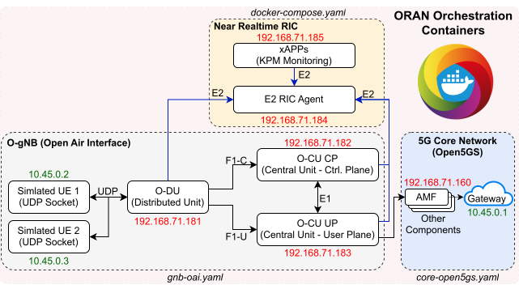

# O-RANClaw-xApp-Based-E2-MitM-Fuzzing




This repository provides a containerized deployment solution for Open Radio Access Network (ORAN) using Docker Compose. The `docker-compose.yaml` file orchestrates the deployment of all the necessary software components, including the core network, gNB (DU, CU-CP, CU-UP), UE simulator, and near-realtime RIC agent:

* **5G Core Network:** The core network is implemented using the open5gs software. Open5GS is an open-source project that provides a complete 3GPP-compliant 5G core network solution. It includes various network functions such as AMF, SMF, UPF, NRF, and more. The core network is responsible for handling user authentication, session management, and data forwarding between the gNB and external networks.

* **gNB (DU, CU-CP, CU-UP):** The gNB (Next Generation Node B) is the base station in the ORAN architecture. It is implemented using the OpenAirInterface (OAI) software. OAI is an open-source project that provides a complete software implementation of the 4G/5G radio access network. The gNB is split into three components:
  - **Distributed Unit (DU):** The DU is responsible for the lower layers of the radio protocol stack, including the physical layer (PHY) and the medium access control (MAC) layer. It handles the baseband processing and communicates with the CU-CP and CU-UP.
  
  - **Central Unit - Control Plane (CU-CP):** The CU-CP handles the control plane functions of the gNB. It manages the radio resource control (RRC) protocol and communicates with the core network for signaling purposes.
  
  - **Central Unit - User Plane (CU-UP):** The CU-UP handles the user plane functions of the gNB. It processes the user data packets and forwards them between the DU and the core network.
  
* **UE Simulator:** The UE (User Equipment) simulator is used to emulate the behavior of mobile devices in the ORAN network. It connects to gNB via RF simulation and core network. You can access the UE simulator container to simulate various scenarios and load conditions (e.g., `iperf3`).

* **Near-Realtime RIC Agent:** The near-realtime RIC agent is implemented using the FlexRIC software. FlexRIC is an open-source platform that provides a flexible and extensible framework for developing and deploying RAN intelligent controllers in an ORAN environment. The near-realtime RIC agent is responsible for managing and orchestrating the xAPPs, as well as providing interfaces for external components to interact with the RIC.
* **xAPPs:** xAPPs (ORAN Applications) are software applications that run on top of the near-realtime RIC (RAN Intelligent Controller). They provide various functionalities and services to optimize and enhance the performance of the ORAN network. Examples of xAPPs include traffic steering, quality of service (QoS) optimization, and radio resource management.


### 1 - Install latest docker and docker composer

```python
./requirements.sh
```


#### 2 - Start Core Network

Run the command below in a separate terminal and wait until you see successful UDR related logs:

```bash
docker compose --profile core up # Terminal 1 - Core Network
```

Successful UDR logs:

```bash
udr-1    | 04/12 07:58:12.304: [sbi] INFO: [6250a1de-f8a2-41ee-bdd9-0f6b7e1be1b5] NF registered [Heartbeat:10s] (../lib/sbi/nf-sm.c:221)
udm-1    | 04/12 07:58:12.304: [sbi] INFO: (NRF-notify) NF registered [6250a1de-f8a2-41ee-bdd9-0f6b7e1be1b5:1] (../lib/sbi/nnrf-handler.c:924)
udm-1    | 04/12 07:58:12.304: [sbi] INFO: [UDR] (NRF-notify) NF Profile updated [6250a1de-f8a2-41ee-bdd9-0f6b7e1be1b5:1] (../lib/sbi/nnrf-handler.c:938)
nrf-1    | 04/12 07:58:12.304: [nrf] INFO: [68e13194-f8a2-41ee-a707-db685e0fa5ce] Subscription created until 2024-04-13T07:58:12.304328+00:00 [validity_duration:86400] (../src/nrf/nnrf-handler.c:445)
udr-1    | 04/12 07:58:12.304: [sbi] INFO: [68e13194-f8a2-41ee-a707-db685e0fa5ce] Subscription created until 2024-04-13T07:58:12.304328+00:00 [duration:86400,validity:86399.999815,patch:43199.999907] (../lib/sbi/nnrf-handler.c:708)
```


#### 3 - Add UE Subscribers

Add sample UE subscribers to the core network so tha the UE Simulator can register to the network:

```python
./scripts/add_subcribers.sh
```

A successful output is shown below:

```bash
{
  acknowledged: true,
  insertedId: ObjectId('6618ec5e2d06d1bb877b2da9')
}
Done!
```

**Note that you can modify the details of UE SIM card (imsi, key, opc, apn) in the files `gnb-oai.yaml` and `scripts/add_subcribers.sh`**


#### 4 - Start ORAN gNB + UE Simulation + Near Realtime RIC

Run the command below in a separate terminal and wait until you see successful UE related logs:

```bash
docker compose --profile gnb-rfsim up # Terminal 2 - gNB + UE Simulation + Near Realtime RIC
```

Successful UE logs:

```bash
oai-ue-rfsimu-2-1  | [NR_PHY]   ============================================
oai-ue-rfsimu-2-1  | [NR_PHY]   Harq round stats for Downlink: 2735/1/0
oai-ue-rfsimu-2-1  | [NR_PHY]   ============================================
```

Note that two simulated UEs are started (containers `oai-ue-rfsimu-1-1` and `oai-ue-rfsimu-2-1`). You can add or remove UEs from the simulation by modifying file `gnb-oai.yaml`.


#### 5 - Run commands in the UE (iperf)

###### UE to Core Network

You can test UE Uplink/Downlink transfer speed by running iperf against the core network, which has default IP address of `10.45.0.1`:

```bash
docker compose exec -it oai-ue-rfsimu-1 iperf3 -c 10.45.0.1 -t0 # Terminal 3 - UE to Core Transfer
```

If the command is successful and the UE is registered to the core network, iperf should indicate a bitrate of about 100mbits/sec as shown below:

```bash
[ ID] Interval           Transfer     Bitrate         Retr
[  5]   0.00-1.65   sec  22.2 MBytes   113 Mbits/sec    0             sender
```

###### Core Network to UE

Similarly, you can run iperf against UEs, which are usually registered to IP addresses `10.45.0.2` or `10.45.0.3`:

```bash
docker compose exec -it upf iperf3 -c 10.45.0.3 -t0 # Terminal 3 - Core to UE Transfer
```


#### 6 - Start xAPP

Start a [xAPP KPI monitoring](https://gitlab.eurecom.fr/mosaic5g/flexric/-/blob/master/examples/xApp/c/monitor/xapp_kpm_moni.c?ref_type=heads) example by running the command below:

```bash
docker compose --profile xapp up # Terminal 4 - xAPP
```

The xAPP informs the downlink and uplink throuput of all connected UEs as shown below:

```bash
xapp-kpm-monitor-1  | ran_ue_id = 1
xapp-kpm-monitor-1  | DRB.RlcSduDelayDl = 6014.82 [μs]
xapp-kpm-monitor-1  | DRB.UEThpDl = 250493.20 [kbps]
xapp-kpm-monitor-1  | DRB.UEThpUl = 4843.06 [kbps]
xapp-kpm-monitor-1  | RRU.PrbTotDl = 354196 [PRBs]
xapp-kpm-monitor-1  | RRU.PrbTotUl = 30572 [PRBs]
```

